# Assignment 1 - VPC & Networking
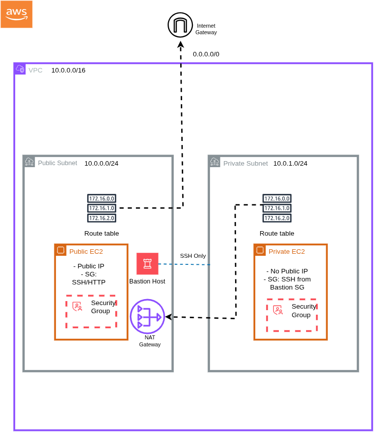
---
**Description:** This assignment demonstrates the creation of a custom *VPC* with public and private subnets, proper *routing*, *security groups*, *EC2 instances*, a *Bastion host*, and *CloudWatch monitoring*. It showcases fundamental *AWS Networking concepts* and secure deployment practices.

**Objective:**
- Build a custom VPC (10.0.0.0/16) with one *public* and one *private* subnet.
- Set up *Internet Gateway* and *NAT Gateway* for proper routing.
- Launch *public and private EC2 instances* with appropriate security.
- Configure a *Bastion Host* for private EC2 access.
- Enable *CloudWatch monitoring* for the instances. 

---

## Task 1: Create the VPC
**What I did:**
- Create a custom VPC with *IPv4 CIDR 10.0.0.0/16*.
- 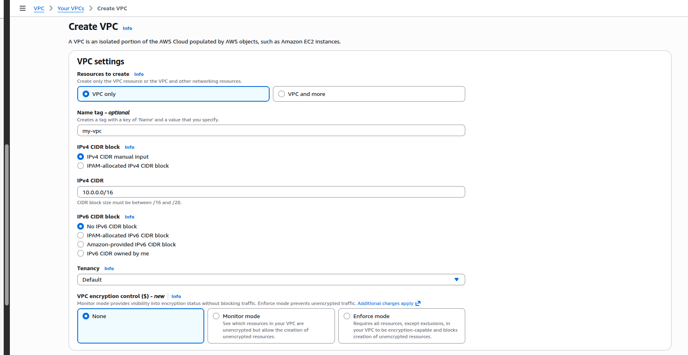

- Create one public subnet with CIDR block 10.0.0.0/24.
- Create one private subnet with CIDR block 10.0.1.0/24.
- 

**Importance:**
- Establish an isolated network environment for my resources.
- The CIDR blocks chosen for the subnets provide enough usable IPs (10.0.0.0/24 gives us 256 addresses).
- Subnets use /24 to provide enough usable IPs without wasting space; larger blocks (e.g., /20) would allocate too many addresses unnecessarily.

---

## Task 2: Internet Access
**What I Did:**
- Create and attach an Internet Gateway (IGW) to the VPC.
- 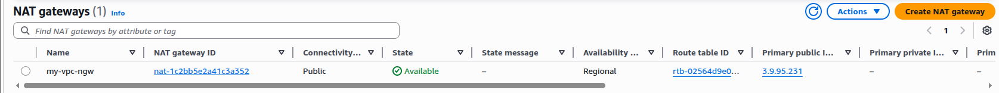

- Create an Elastic IP (EIP) for the NAT Gateway.
- 

- Create a NAT Gateway in the public subnet and associate it with the EIP.
- 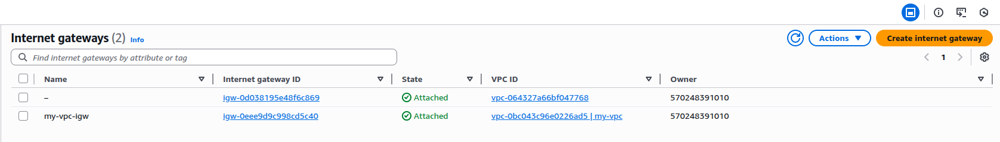

**Importance:**
- IGW allows public subnet resources to access the Internet.
- Private subnet instances use the NAT Gateway to reach the Internet without exposing their private IPs.
- The EIP ensures the NAT Gateway has a static, public-facing IP, so outbound traffic can reliably reach the Internet.

---

## Task 3: Route Tables
**What I Did:**
- Create a public route table and associate it with the public subnet.
- Do the same for the private route table and associate it with the private subnet.
- 
- 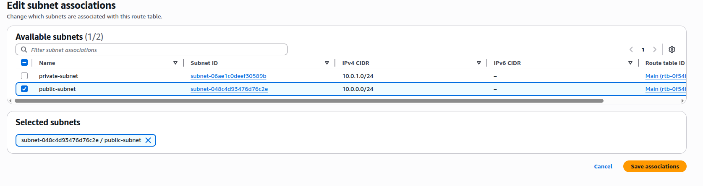

- Add a 0.0.0.0/0 route to the private subnet via the *NAT Gateway*. To do this, select route table -> actions -> edit routes.
- Add a 0.0.0.0/0 route to the public subnet via the *Internet Gateway*.
- 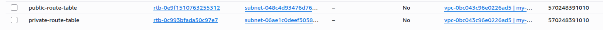

**Importance:**
- The public route table allows instances in the public subnet to access the Internet directly through the IGW.
- The private route table routes traffic from private instances through the NAT Gateway, providing secure Internet access without exposing private IPs.
- Explicit subnet associations ensure traffic flows correctly and prevents accidental exposure of private subnets.

## Task 4: Create EC2 Instances
**What I Did:**
- Launch a public EC2 instance in the public subnet with the HTTP security group applied. Allow HTTP from anywhere, to test web access externally.
- 

- Confirm Delete on Termination is set to Yes in Storage settings. This is very important to ensure the instance is removed when the environment is deleted.
- 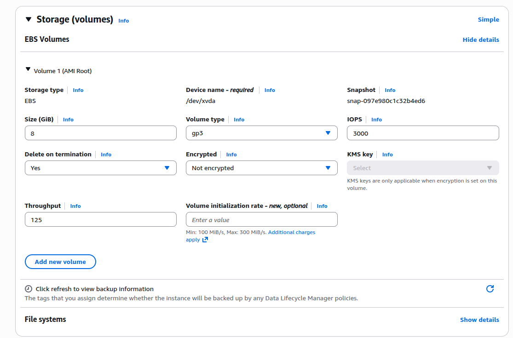

- Add user data to the public EC2 to display a welcome message via the web server.
- 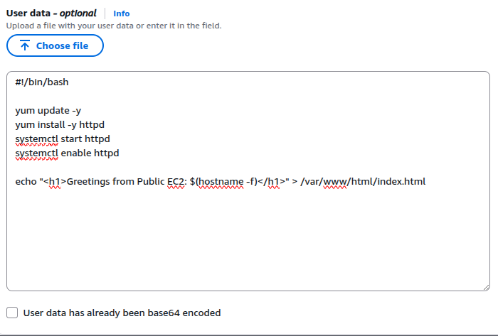

- Launch a private EC2 instance in the private subnet with auto-assign public IP disabled and apply a security group allowing SSH only from the Bastion host.
- 

- Wait for both EC2 instances to be running.
- 

**Importance:**
- The public EC2 allows direct Internet access and testing of HTTP connectivity.
- The user data ensures the instance has a functional web server and a visible message for verification.
- The private EC2 remains secure without a public IP, forcing access through the Bastion host.
- Security groups enforce least privilege access, keeping private instances protected from direct Internet access.

---

## Task 5: Bastion Host & Security Configuration
**What I Did:**
- Create a Bastion Host security group that allows SSH access only from my own IP address. This ensures the Bastion is tightly locked down and only I can connect.
- 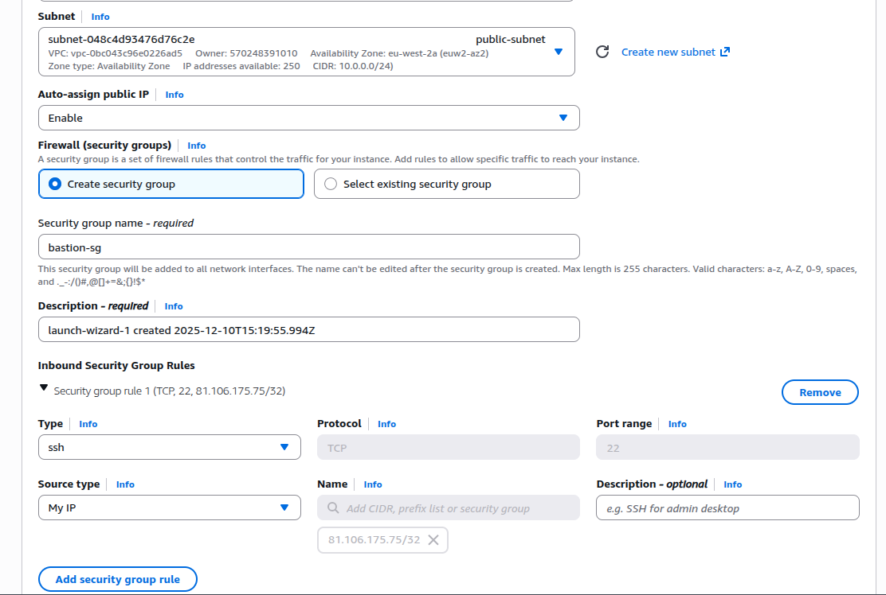

- Add an inbound SSH rule to the private EC2’s security group, allowing port 22 only from the Bastion Host’s private IP (10.0.0.60/32).
- 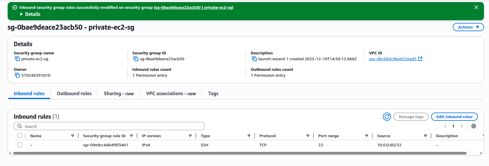

**Importance:**
- Limiting SSH on the Bastion to your own IP prevents unauthorized access.
- Only allowing SSH to the private EC2 from the Bastion ensures the private instance stays isolated and unreachable from the Internet.
- This setup follows a standard, secure jump-host pattern used in real production environments.

---

## Optional / Bonus Tasks
**What I Did:**
- Connect to the Bastion Host using SSH with the Bastion key PEM and the public IP of the Bastion:
`ssh -i bastion-key.pem ec2-user@<bastion-public-ip>`
- 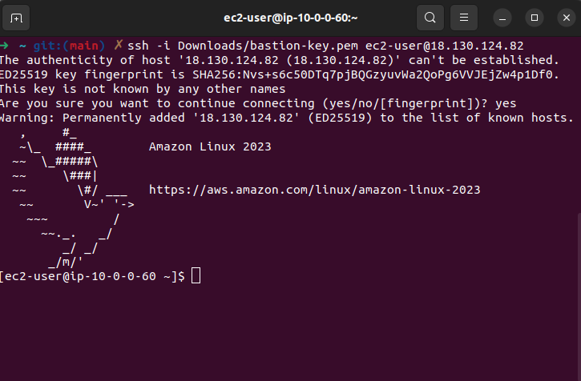

- Copy the private EC2 key PEM to the Bastion using the Bastion’s public IP:
`scp -i bastion-key.pem private-ec2-key.pem ec2-user@<bastion-public-ip>:~/`

- From the Bastion, SSH into the private EC2 using its private IP and the copied key:
`ssh -i private-ec2-key.pem ec2-user@<private-ec2-private-ip>`
- 

- Enable CloudWatch monitoring for both EC2 instances.
- 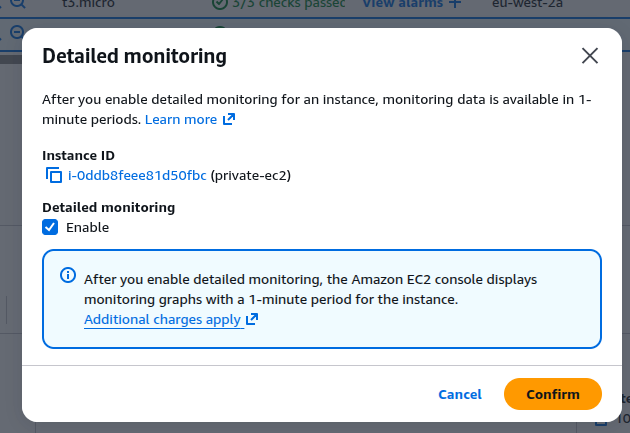

- Verify the CloudWatch metrics for the instances.
- 

**Importance:**
- SSH through the Bastion Host ensures private EC2 instances remain isolated from the Internet while still allowing secure access.
- Using `scp -i` securely transfers the private key to the Bastion, enabling SSH into private instances without exposing the key publicly.
- Enabling CloudWatch monitoring provides visibility into instance health and performance, which is essential for operational awareness and troubleshooting.

---

## Conclusion
**What I learnt:**
- How to design and build a custom VPC with public and private subnets.
- Proper route table configuration for IGW and NAT Gateway.*
- Understanding the function of the *Internet Gateway* and *NAT Gateway* for public and pricate subnet routing.
- Launching EC2 instances with different subnet types and managing security groups.
- Using a Bastion Host to securely access private EC2 instances.
- Setting up CloudWatch monitoring and interpreting instance metrics.

**Challenges & How I Overcame Them:**
- Deciding correct CIDR blocks for VPC and subnets: I reviewed IP ranges and subnetting rules to avoid overlaps.
- Accessing private EC2 instances: Initially I didn’t have a private EC2 key PEM, so I generated one and copied it to the Bastion using scp -i.
- Security group configuration: Ensuring least privilege access while still allowing SSH through Bastion required careful planning of inbound rules.
- Remembering the right IPs: I tracked which IPs were public (for Bastion) vs private (for private EC2) to avoid connection errors.