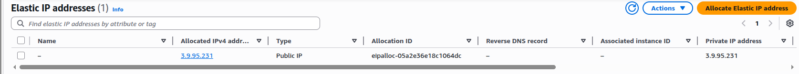
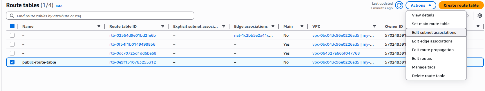
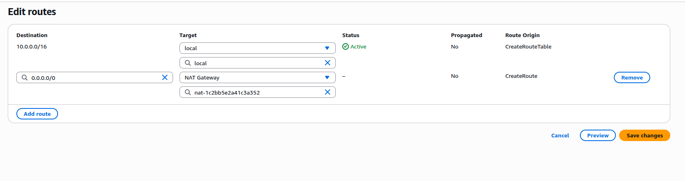
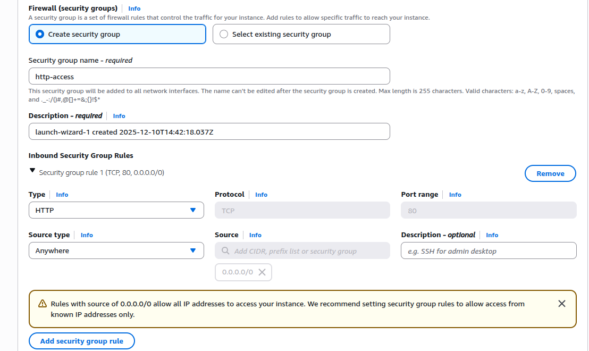
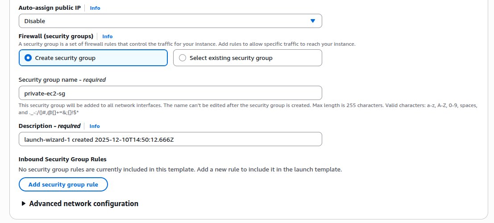
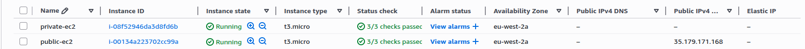

# Assignment 1 - VPC & Networking
---
**Description:** This assignment demonstrates the creation of a custom *VPC* with public and private subnets, proper *routing*, *security groups*, *EC2 instances*, a *Bastion host*, and *CloudWatch monitoring*. It showcases fundamental *AWS Networking concepts* and secure deployment practices.

**Objective:**
- Build a custom VPC (10.0.0.0/16) with one *public* and one *private* subnet.
- Set up *Internet Gateway* and *NAT Gateway* for proper routing.
- Launch *public and private EC2 instances* with appropiate security.
- Configure a *Bastion Host* for private EC2 access.
- Enable *CloudWatch monitoring* for the instances. 

---

## Task 1: Create the VPC
**What I did:**
- Created a custom VPC with *IPv4 CIDR 10.0.0.0/16*.

- Created one public subnet with CIDR block 10.0.0.0/24.
- Created one private subnet with CIDR block 10.0.1.0/24.

**Importance:**
- Establish an isolated network environment for my resources.
- The CIDR blocks chosen for the subnets provides us with enough usable IPs (10.0.0.0/24 gives us 256 addresses).
- Subnets use /24 to provide enough usable IPs without wasting space; larger blocks (e.g., /20) would allocate too many addresses unnecessarily.

---

## Task 2: Internet Access
**What I Did:**
- Created and attached an Internet Gateway (IGW) to the VPC.

- Created an Elastic IP (EIP) for the NAT Gateway.

- Created a NAT Gateway in the public subnet and associated it with the EIP.

**Importance:**
- IGW allows public subnet resources to access the Internet.
- Private subnet instances use the NAT Gateway to reach the Internet without exposing their private IPs.
- The EIP ensures the NAT Gateway has a static, public-facing IP, so outbound traffic can reliably reach the Internet.

---

## Task 3: Route Tables
**What I Did:**
- Created a public route table and associated it with the public subnet.
- Do the same for the private route table and private subnet.

- Added a 0.0.0.0/0 route to the private subent via the **NAT Gateway**. Click on the route table -> actions -> edit routes.
- Do the same for the public subnet but via the **Internet Gateway**.

- After doing this, route tables should look like this:

W
**Importance:**
The public route table allows instances in the public subnet to access the Internet directly through the IGW.
The private route table routes traffic from private instances through the NAT Gateway, providing secure Internet access without exposing private IPs.
Explicit subnet associations ensure traffic flows correctly and prevents accidental exposure of private subnets.

## Task 4: Create EC2 Instances
**What I Did:**
- Launched a public EC2 instance in the public subnet with the HTTP security group applied. Allowed HTTP from anywhere to test web access externally.

- Confirmed Delete on Termination was set to Yes in Storage settings.. This is very important to ensure the instance is removed when the environment is deleted.

- Added user data to the public EC2 to display a welcome message via the web server.

- Launched a private EC2 instance in the private subnet with auto-assign public IP disabled and applied a security group allowing SSH only from the Bastion host.

- Wait for both EC2 instances to be running.

**Importance:**
- The public EC2 allows direct Internet access and testing of HTTP connectivity.
- The user data ensures the instance has a functional web server and a visible message for verification.
- The private EC2 remains secure without a public IP, forcing access through the Bastion host.
- Security groups enforce least privilege access, keeping private instances protected from direct Internet access.

---