# Assignment 2 - Application Load Balancer
---
**Description:** This assignment demonstrates a common real-world DevOps architecture using an *Application Load Balancer* to distribute traffic across multiple EC2 instances. It focuses on high availability, secure access, and proper network isolation by placing private EC2 instances behind an ALB. *This assignment is using the same VPC from assignment 1, everything is the same apart from the instances which we terminated.*

**Objective:**
- Deploy 2 EC2 instances in private subnets.
- Distribute traffic using an Application Load Balancer.
- Ensure EC2 instances are not directly accessible from the internet.
- Configure health checks to monitor instance availability.
- Validate load balancing by serving different content from each instance.
- Secure traffic using HTTPS (bonus).

---
## Task 1: Launch two EC2 instances
**What I Did:**
- Create two private subnets in different Availability Zones with different CIDR blocks.
- 

- Create two public subnets in different Availability Zones.

- Create a new security group for the Application Load Balancer and add an inbound HTTP rule from anywhere.
- 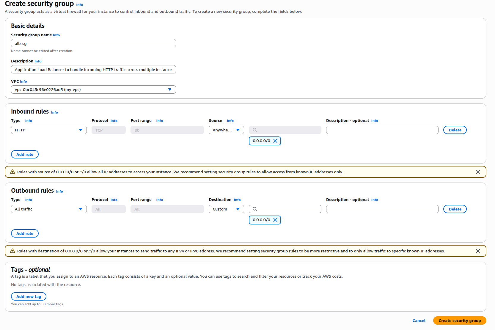

- Update the private EC2 security group to allow HTTP inbound traffic only from the ALB security group.
- 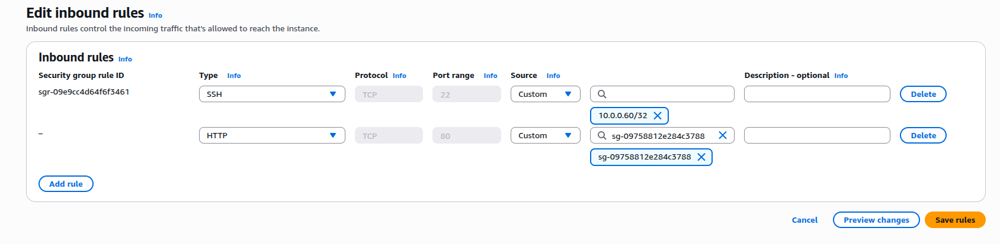

- Launch two EC2 instances in the same VPC, each in a different private subnet and Availability Zone.
- Configure user data on each instance to install Apache and return different messages for identification.
- Ensure both instances use the private EC2 security group and have no public IP assigned.
- 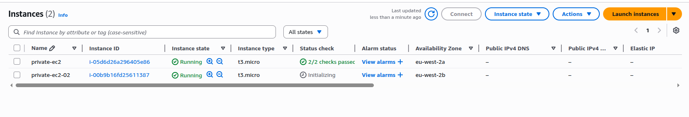

**Importance:**
- Ensures high availability by deploying instances across multiple Availability Zones.
- Keeps application instances private and inaccessible from the public internet.
- Prepares instances to be used behind a load balancer.
- Allows easy verification of load balancing by serving different content from each instance.
- Demonstrates proper network segmentation and security best practices.

---

## Task 2: Set Up the Application Load Balancer
**What I Did:**
- Go to **EC2 → Load Balancers** and create a new load balancer, selecting **Application Load Balancer** as the type.
- 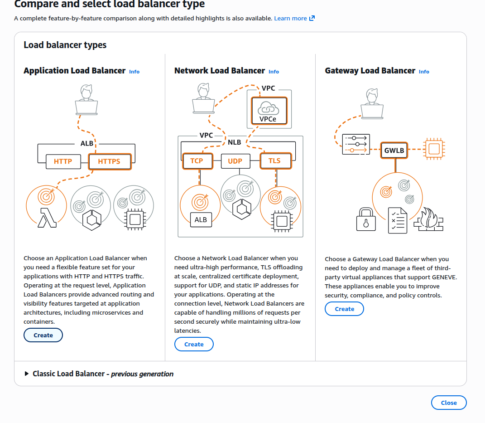

- Configure the ALB to use the correct VPC and select **two public subnets in different Availability Zones**.

- Add an HTTP listener on port 80 and choose **Forward to target group** as the default action.
- 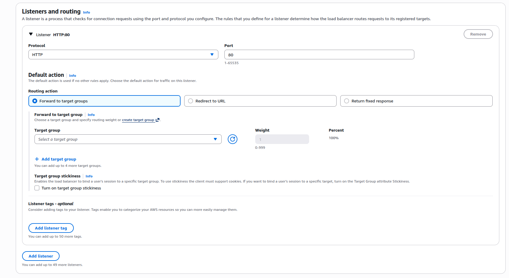

- Click **Create target group** next to the forward action to create a new target group.
- 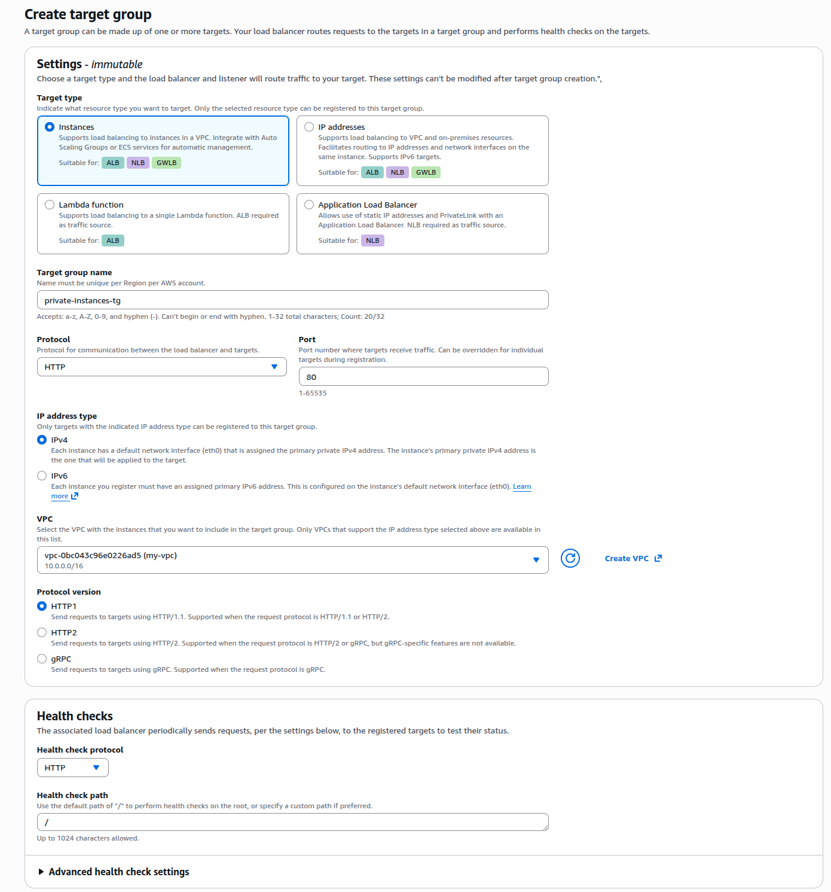

- Configure the target group to use **Instances** as the target type and HTTP on port 80, leaving remaining settings as default.
- Register both private EC2 instances as targets and keep them in pending state.
- 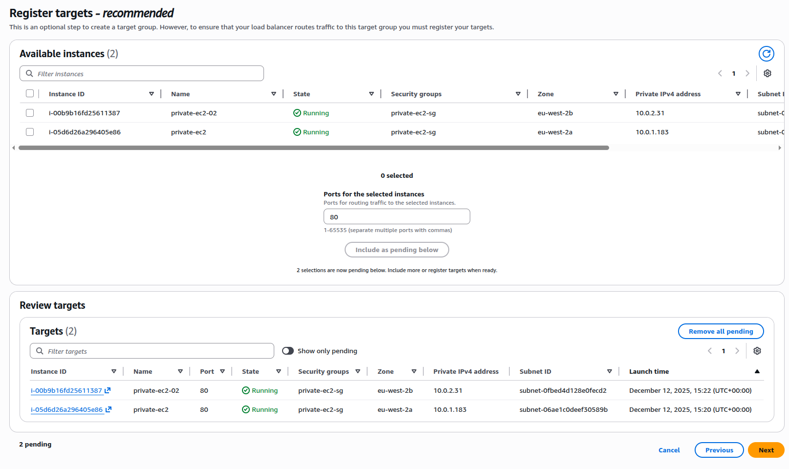

- Complete the load balancer creation and select the newly created target group as the default action.
- 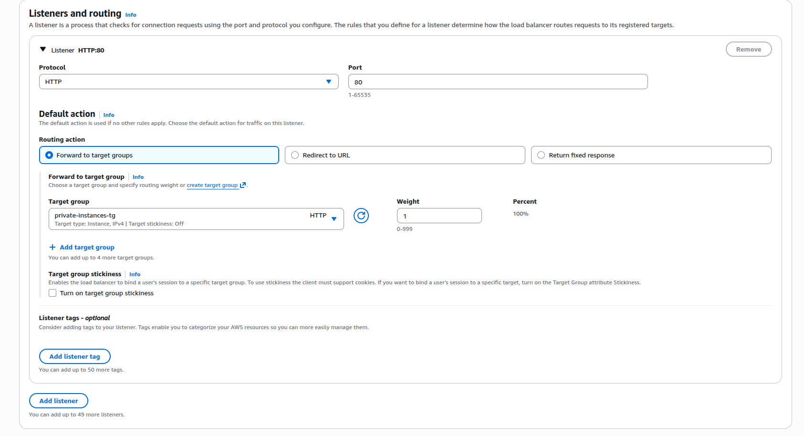

- Configure **health checks** on the root path `/`. (Note: the 2nd EC2 initially showed unhealthy because its private subnet was using only the local route table and lacked NAT access.)
- 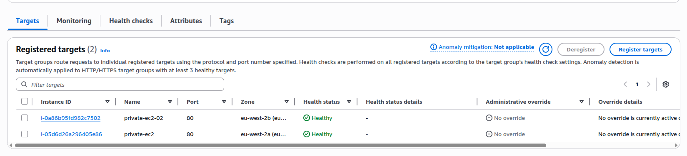

- Check the ALB name and copy the DNS into an incognito browser to verify traffic reaches the instances.
- 

**Importance:**
- Distributes incoming traffic evenly across multiple EC2 instances for high availability.  
- Ensures application traffic is routed only to healthy instances via health checks.  
- Identifies network misconfigurations early, such as routing issues that can prevent instances from passing health checks.  
- Provides a single entry point for the application, simplifying DNS and future HTTPS integration.  
- Prepares the architecture for future scaling and secure access.

---

## Optional / Bonus Tasks: DNS & HTTPS
**What I Did:**
- Purchase and use a domain from Cloudflare for the application.
- In **AWS Route 53**, create a new hosted zone and enter the domain name.
- 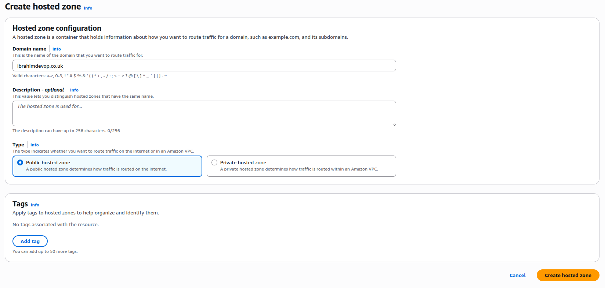

- In Cloudflare, create a new **CNAME DNS record**:
  - Name: `@`  
  - Target: copy the DNS from the Application Load Balancer  
  - Turn proxy off (DNS only) and save.
- 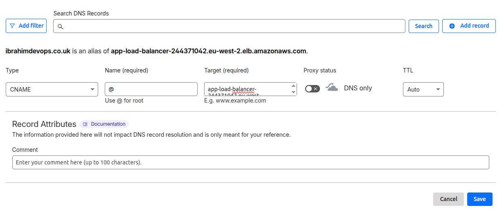

- Test the domain by entering it into the browser.
- 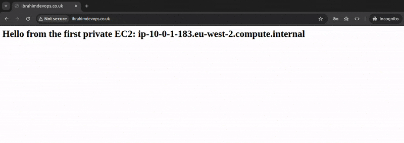

- Request a new certificate in **AWS Certificate Manager (ACM)** for the domain.
- 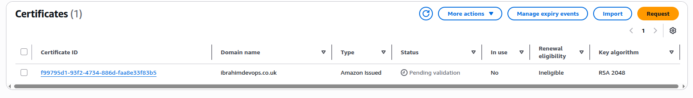

- Add the ACM certificate CNAME to a new Cloudflare record for validation:
  - CNAME name → name  
  - CNAME value → target  
  - Proxy status: off (DNS only), then save.

- Once the certificate is issued, go to the ALB and **add an HTTPS listener** on port 443, selecting the ACM certificate.
- 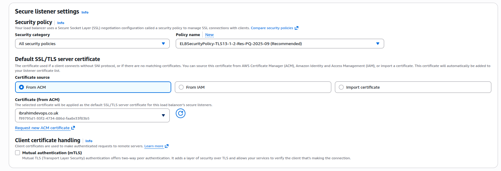

- Add an HTTPS inbound rule to the ALB security group to allow traffic on port 443.
- 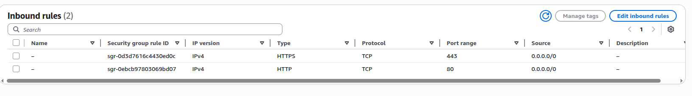

- Verify HTTPS works in the browser using the domain.
- 

- Redirect all HTTP traffic to HTTPS to secure the connection:
  - Go to ALB → edit HTTP listener → add a new rule  
  - Condition: path = `/`  
  - Set priority higher than 1 (e.g., 2) and save.
- 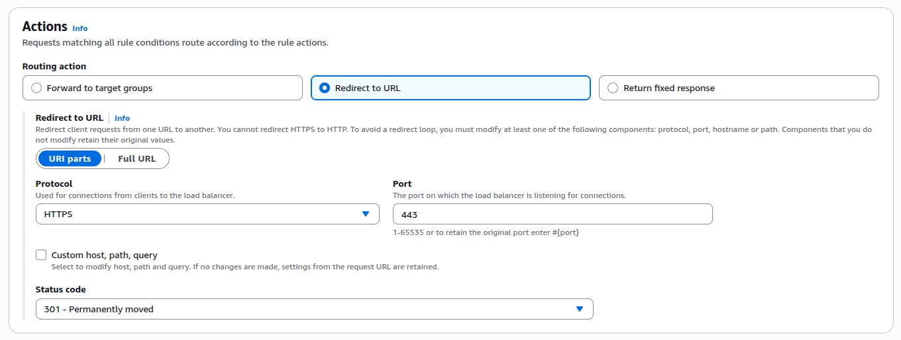

- Check the browser for both HTTP and HTTPS URLs to confirm redirect and secure connection.
- 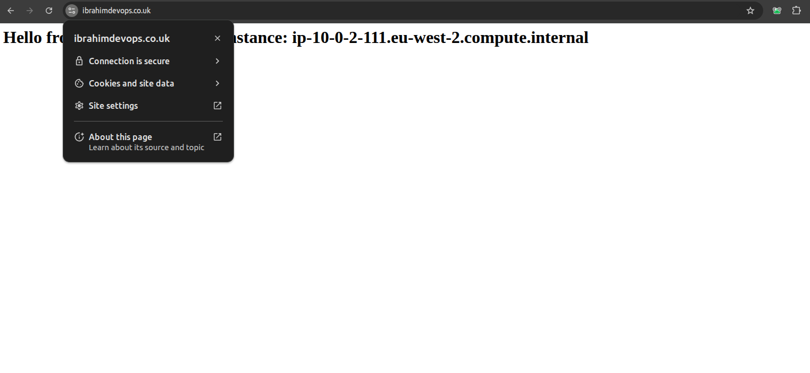

**Importance:**
- Associates a custom domain with the application for professional presentation.  
- Ensures traffic is secured using HTTPS and a valid ACM certificate.  
- Verifies that all HTTP traffic is automatically redirected to HTTPS for security best practices.  
- Demonstrates integration of DNS, SSL/TLS certificates, and load balancer configuration.  

---

## Conclusion
**What I learnt:**
- How to design and deploy a highly available architecture using private EC2 instances behind an Application Load Balancer.  
- Configuring security groups to isolate instances while allowing ALB traffic.  
- How to create and validate ACM certificates for HTTPS and integrate them with an ALB.  
- How to set up DNS using Route 53 and Cloudflare to point a custom domain to the ALB.  
- How health checks work and how to troubleshoot instances failing them.  
- The importance of subnet configuration, routing, and proper load balancer setup for a production-ready environment.

**Challenges & How I Overcame Them:**
- Private EC2 instances initially failing health checks: Resolved by updating the second private subnet to use the correct route table with NAT access.  
- HTTPS listener not reachable: Fixed by adding port 443 inbound rule to the ALB security group.  
- ACM certificate validation: Learned to correctly add the CNAME record in Cloudflare with DNS only mode to complete validation.  
- Redirecting HTTP → HTTPS: Figured out how to add a listener rule with a condition and priority to ensure all HTTP traffic redirects securely.  
